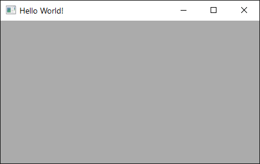
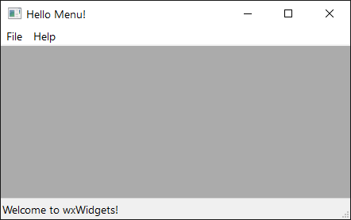
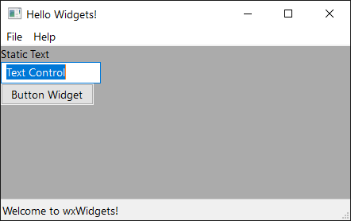
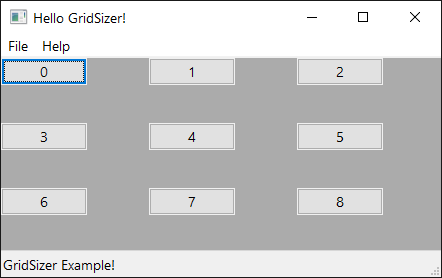
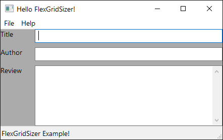

# wxWidget: Hello world examples

This repository contains the code examples for the hello world graphical user
interface (GUI) applications discussed in lecture.

## hello_world

This example shows an empty window like the following:

## hello_menu

This one extends `hello_world` by adding a menu bar.

## hello_widgets

This one extends `hello_menu` by adding widgets in the window area. Three
widgets were added: [wxStaticText](https://docs.wxwidgets.org/trunk/classwx_static_text.html),
[wxTextCtrl](https://docs.wxwidgets.org/trunk/classwx_text_ctrl.html),
and [wxButton](https://docs.wxwidgets.org/trunk/classwx_button.html).
Widgets are stacked vertically with a [wxBoxSizer](https://docs.wxwidgets.org/trunk/classwx_box_sizer.html).

## hello_gridSizer

This example uses [wxGridSizer](https://docs.wxwidgets.org/trunk/classwx_grid_sizer.html)
to organized buttons in a 3x3 grid, all of them have equal size.

## hello_flexGridSizer

This example shows how to use [wxFlexGridSizer](https://docs.wxwidgets.org/trunk/classwx_flex_grid_sizer.html)
to organize widgets in a grid where not all of them have same size. Items in
same column have same width. Items in same row have same height.

## Build Instructions

Use `build.sh` or `build.bat` to compile, or the CMake presets in `vscode` as
in the assignments.

## References

- [wxWidgets](https://www.wxwidgets.org/)
- [Tutorial](https://zetcode.com/gui/wxwidgets/)
